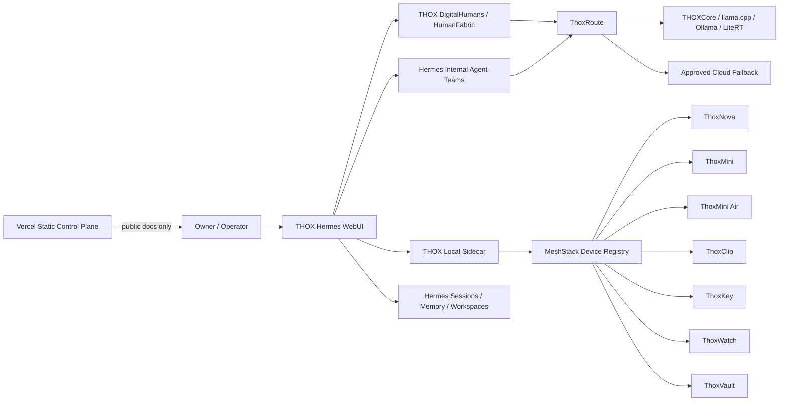

# THOX Hermes Ecosystem Map

## Architectural rule

Private sessions, memory, tools, credentials, local models, and device telemetry stay on owner-controlled infrastructure. Cloud surfaces are optional, explicit, and policy-governed.
