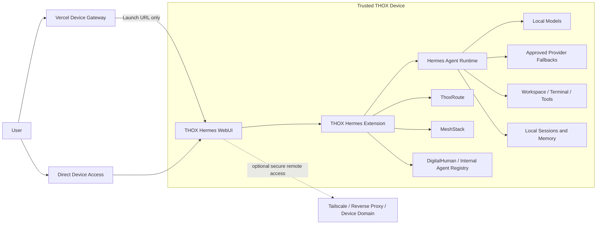

# THOX Hermes Ecosystem Map

**Status:** Implementation baseline  
**Canonical repository:** `ttracx/ThoxHermes-webui`  
**Upstream:** `nesquena/hermes-webui`  
**Active delivery branch:** `feat/thox-ai-digitalhuman-suite`

## System intent

THOX Hermes is the local-first operator experience for THOX DigitalHumans, internal agents, device applications, and platform services. It preserves upstream Hermes WebUI compatibility while adding a THOX-owned presentation and orchestration layer.

The architecture deliberately separates the durable local agent runtime from the optional cloud-facing device gateway:



## Major modules

| Module | Responsibility | Runtime boundary | Current implementation |
|---|---|---|---|
| Hermes core | Sessions, streaming, tools, workspace, terminal, providers, memory | THOX device | Upstream preserved |
| THOX design extension | THOX.ai tokens, visible branding, responsive device density, command center | Browser on THOX device | `thox/extensions/thox-hermes` |
| DigitalHuman launcher | Agent activation prompts and internal specialist routing | Browser + Hermes composer | Implemented in extension |
| Device profiles | Nova, Mini, Mini Air, Clip, Key, Watch and automatic responsive modes | Browser | Implemented in CSS/JS |
| THOX device gateway | Endpoint selection, health probe, device and agent launch context | Vercel static deployment | `thox/vercel` |
| Local launchers | Supported extension environment configuration | Linux, macOS, WSL, Windows | `thox/start-thox.*` |
| Container overlay | Mount THOX extension without changing upstream image contract | Docker Compose | `thox/docker-compose.override.yml` |
| ThoxRoute adapter | Model routing health, local-first policy and provider fallback | Local service | Interface surfaced; service integration next |
| MeshStack adapter | Node discovery, offline state and synchronization | Local/mesh service | Interface surfaced; service integration next |
| Agent registry | Versioned DigitalHuman identity, capabilities, policy and prompt packages | Local-first registry | Static MVP implemented; API-backed registry next |

## Data and trust boundaries

1. Conversations, memory, workspaces, files, terminal sessions, model credentials, and tool execution remain in the self-hosted Hermes environment.
2. The Vercel gateway stores only the selected endpoint in browser `localStorage`; it does not proxy agent traffic.
3. Extension assets are same-origin and execute with the authenticated Hermes browser session, so only THOX-reviewed extension code should be enabled.
4. Agent activation is prepared in the composer and is not auto-sent by default.
5. Device endpoints must enforce authentication and TLS when exposed beyond loopback or a trusted private network.

## Integration contracts

### Device gateway → THOX Hermes

```text
GET {device-endpoint}/?device={profile}&thoxAgent={agent-id}&source=thox-device-gateway
```

The extension consumes the launch context, prepares the appropriate activation prompt, then removes the agent identifier from browser history.

### THOX services

Planned local service contracts:

```text
GET  /api/thox/fleet/health
GET  /api/thox/agents
POST /api/thox/agents/{agent_id}/activate
GET  /api/thox/route/status
GET  /api/thox/mesh/nodes
POST /api/thox/mesh/sync
```

These routes should be implemented as authenticated Hermes-compatible sidecars or narrow upstream adapters, not arbitrary browser proxies.

## Device experience matrix

| Device | Primary mode | UI behavior | Agent workload |
|---|---|---|---|
| ThoxNova | Full workstation | Three-panel, workspace and terminal visible | Complex orchestration and local inference |
| ThoxMini | Compact portable | Reduced density and compact command center | Portable assistant and development tasks |
| ThoxMini Air | Touch-forward | Larger touch targets and quick actions | Wireless local assistant |
| ThoxClip | Mobile handoff | Touch-forward, fast action surface | Context capture and delegated execution |
| ThoxKey | Portable workspace | Compact workspace and recovery-oriented access | Local launcher, models and offline documents |
| ThoxWatch | Minimal command mode | Sidebar/workspace hidden, single-column actions | Voice, status and short commands |

## Repository boundaries

```text
thox/
├── extensions/thox-hermes/   # Runtime branding and agent/device UX
├── vercel/                   # Deployable cloud device gateway
├── docker-compose.override.yml
├── start-thox.sh
└── start-thox.ps1

ecosystem_map.md              # System topology and contracts
mvp_catalog.md                # Product slices and acceptance criteria
development_queue.md           # Ranked execution backlog
```
